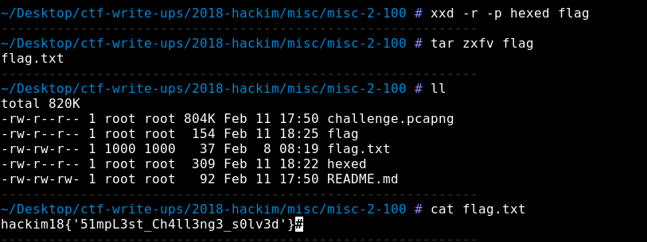

## Misc 2 (Misc, 100pt)

>Find the transferred file
>> [challenge.pcapng](challenge.pcapng)

We were provided a pcap-ng capture file so it's time for Wireshark.


Pcap file had 1675 packets and with the description of challenge in mind, we extracted all image files from HTTP protocol trying to find some clues. The search query for Wireshark was 
```
http.request.method == "GET" or http.response.code == 200
```


These packets provided some images, which we extracted with export bytes option from Wireshark.
We tried a stego challenge approach with binwalk, strings, steghide and exif-tool but nothing seemed to work because all images had a trollish vibe.

Thanks to our teammate [@rkmylo](https://github.com/rkmylo) who analyzed all pictures earlier and he hinted us about interesting bytes in ICMP packets.
This [writeup](https://github.com/ctfs/write-ups-2015/tree/master/nuit-du-hack-ctf-quals-2015/forensic/private) helped me extract the right packets with offset 0020. I used this command 
```
tshark -r challenge.pcapng -x 'icmp and ip.src==192.168.42.218' | grep 0020
```
and got the output you see in the next picture


After combining all hex digits i got the next hex characters

```
1f8b08006c4e7c5a0003edcf3d0ac2401005e01c65bb7432e3cc66ec6dbd43585ccc8a9b20d94910c4bb1bf0070bc1c620c27ecd2be6156f76d1350b3d69312300a82a3653a25878cd3bb6066949022c48620059080a03738e7a1892ba7e9a12d07beab41f24bced7dbadf3e31cffc13c16d0ffb1657e7d2627bdc50d27a1d3846ea1aaa13c4917c79f9f5c82ccbb2ecebae8be834d800080000
```

Unfortunately, i had to leave my laptop because i was in the middle of a flight but my teammate cRat1st0s continued by converting hexdump into binary which he saved in a file with the following command.

```
echo "1f8b08006c4e7c5a0003edcf3d0ac2401005e01c65bb7432e3cc66ec6dbd43585ccc8a9b20d94910c4bb1bf0070bc1c620c27ecd2be6156f76d1350b3d69312300a82a3653a25878cd3bb6066949022c48620059080a03738e7a1892ba7e9a12d07beab41f24bced7dbadf3e31cffc13c16d0ffb1657e7d2627bdc50d27a1d3846ea1aaa13c4917c79f9f5c82ccbb2ecebae8be834d800080000" > hexed
xxd -r -p hexed flag
```

After conversion a gzip popped up that had our precious flag inside.



```
hackim18{'51mpL3st_Ch4ll3ng3_s0lv3d'}
```

## References
* https://github.com/ctfs/write-ups-2015/tree/master/nuit-du-hack-ctf-quals-2015/forensic/private
* https://shankaraman.wordpress.com/tag/asis-ctf-2014-finals-forensics-writeup/